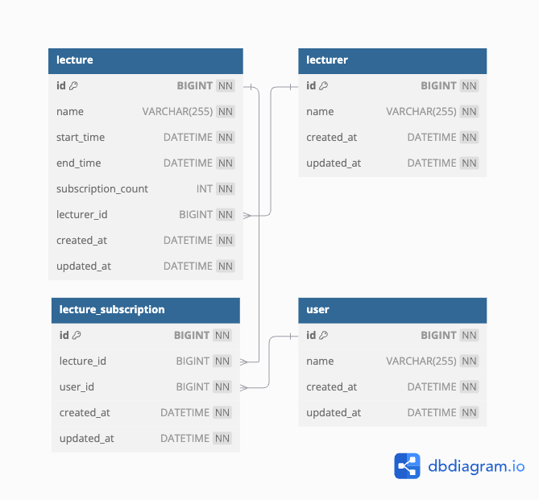

# [ 2주차 과제 ] 특강 신청 서비스

## 기술 스택

- JDK 21
- Kotlin 1.9.25
- Spring Boot 3.4.1
- MySQL 8.0.28

## 실행 방법

1. docker-compose로 MySQL DB 실행
    ```yaml
    docker-compose up -d
    ```
    - MySQL 실행 시 init.sql을 통해 자동으로 create table 진행
2. Application 실행
3. 각 API 호출 시 header에 userId 삽입하여 호출
    - userId가 없거나 해당 id의 User가 존재하지 않으면 "접근이 거부되었습니다." 예외 발생
    - 상세 구현 : API 메서드 내에 UserInfo가 존재하는 경우 [UserInfoArgumentResolver.kt](https://github.com/psh10066/hhplus-lecture/blob/b41dea0444b0bee70d534281e2c2f07180997afd/src/main/kotlin/com/hhplus/lecture/api/resolver/UserInfoArgumentResolver.kt) 에서 header의 userId로 사용자 존재 여부 확인

## 테스트 요구사항

- 테스트 실행 환경에서 docker daemon 실행 필요
    - Testcontainers 실행 시 필요

---

## 요구사항 분석

- [requirements.md](requirements.md)

## ERD



- 세부 DBML은 [erd.md](erd.md) 참고

### 테이블 설계

1. lecture (특강)
    - 날짜별 특강은 `startTime` 컬럼의 날짜로 구분합니다.
    - `lecture_subscription` 테이블에서 해당 특강 ID를 갖는 row 수를 조회하여 신청자 수를 체크해도 되지만, 조회 성능 향상을 위해 `subscription_count` 컬럼을 따로
      관리합니다.
2. lecturer (강연자)
    - 한 강연자가 여러 특강을 진행할 수 있다고 가정하여, 강연자 정보 테이블은 특강 테이블과 분리하여 관리합니다.
3. lecture_subscription (특강 신청)
    - 특강에 신청한 사용자 정보를 관리하기 위한 테이블로, 특강 ID와 사용자 ID를 포함합니다.
    - 동일한 사용자는 동일한 특강에 대해 한 번만 신청할 수 있으므로, 특강 ID와 사용자 ID에 대한 Unique Key 제약 조건을 통해 데이터 정합성을 관리합니다.
4. user (사용자)
    - 테이블에 존재하는 사용자만 특강 신청 및 조회 등 모든 행동(API 호출)을 수행할 수 있습니다.